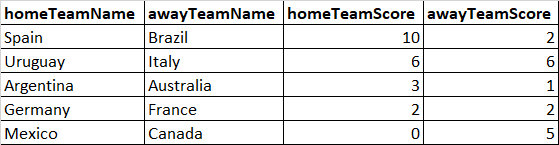
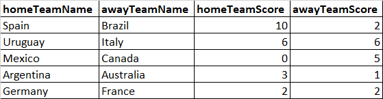

# SportRadar_Tournament
Steps to run the project:
1. git clone and checkout the project from master branch
2. perform maven clean install (mvn clean install).
3. A dummy data set of football data feed is placed under resources.
4. Navigate to PlayFootBall.java and execute the main method.

Assumptions:
1. A live data feed is imitated in resources/dummy_match_data.json
2. The feed send Event and Teams Data.
3. Events are classified specific to a game ,for football (GOAL, OUTSIDE, CORNER) etc.  All assumed values can be found under ENUM (EventTypes).
4. For this problem statement only GOAL Event Type is considered for computation.
5. A Game is termed valid once "gameEnded" flag is turned true in response Json.
6. The last entered data as per Json as as below

   
7. Based on the last data expected output should be 

   
